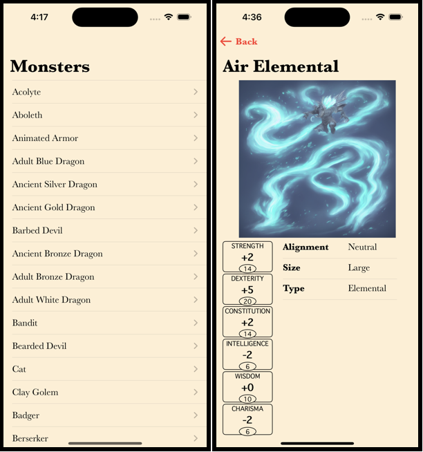
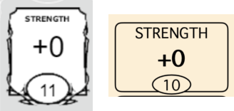

# Dungeons And Dragons Monsters

This project uses the GraphQL [D&D 5e API](https://www.dnd5eapi.co/docs/) to present a list of monsters, and provides details about a monster when the user selects it. It serves as a demonstration of the author's iOS development skills, particularly focusing on SwiftUI development. The following sections provide a tour of the codebase, highlighting key areas that showcase expertise in SwiftUI implementation and discussing the rationale behind a few of the design decisions and trade-offs.

## View and View Model

View code is kept clean and light. Both `MonsterListView` and `MonsterDetailView` have `body`s that are light, organized, and easy to follow.

MonsterDetailView [uses `ViewThatFits`](https://github.com/timfether/DungeonsAndDragonsMonsters/blob/main/DungeonsAndDragonsMonsters/View/MonsterDetailView.swift#L21) to adapt the layout based on the available space, providing the best option based on factors like device size, device orientation, and text size.

MonsterDetailView [makes use of `AsyncImage`](https://github.com/timfether/DungeonsAndDragonsMonsters/blob/main/DungeonsAndDragonsMonsters/View/MonsterDetailView.swift#L50-L57). 

> [!NOTE]
> `AsyncImage` works well here, but comes with trade-offs. A different design would lead to a different consideration of these trade-offs. For instance, if the image were to be used in multiple views, downloading and storing the image data so that it can be used in all necessary places would be a good idea.

## Navigation

Navigation is straightforward and easy to follow. `MonstersListView` is embedded in a `NavigationStack` that uses a `NavigationPath`, which [is passed a monster model object](https://github.com/timfether/DungeonsAndDragonsMonsters/blob/main/DungeonsAndDragonsMonsters/View/MonstersListView.swift#L19) when the row containing that monster is selected. The navigation destination detects that model object, and [creates a `MonsterDetailView`](https://github.com/timfether/DungeonsAndDragonsMonsters/blob/main/DungeonsAndDragonsMonsters/View/MonstersListView.swift#L30-L32), passing it the provided monster.

## Tests

Important logic, including interaction with the ApolloClient, is [supported by unit tests](https://github.com/timfether/DungeonsAndDragonsMonsters/blob/main/DungeonsAndDragonsMonstersTests/MonstersListViewModelTests.swift#L19-L42). A protocol, `ApolloClientProviding` enables a fake client to be created in order to test these interactions.

- The protocol is defined [here](https://github.com/timfether/DungeonsAndDragonsMonsters/blob/main/DungeonsAndDragonsMonsters/Apollo/ApolloClientProviding.swift). ApolloClient's conformance to the protocol is also declared in this file.
- The fake Apollo client is defined [here](https://github.com/timfether/DungeonsAndDragonsMonsters/blob/main/DungeonsAndDragonsMonstersTests/ApolloClient%2BMock.swift).
- Use of the fake client is demonstrated in [these tests](https://github.com/timfether/DungeonsAndDragonsMonsters/blob/main/DungeonsAndDragonsMonstersTests/MonstersListViewModelTests.swift#L19-L42).
- Use of ApolloClient in the app itself is not made more complicated due to this. By default, the view model will create a real Apollo client (when no client is passed in). If a client (real or fake) is passed in when the view model is created, [it will use that instead](https://github.com/timfether/DungeonsAndDragonsMonsters/blob/main/DungeonsAndDragonsMonsters/ViewModel/MonstersListViewModel.swift#L26-L29). This means that the view is free to create the view model [without needing to pass in any parameters](https://github.com/timfether/DungeonsAndDragonsMonsters/blob/main/DungeonsAndDragonsMonsters/View/MonstersListView.swift#L12), but tests can provide a fake ApolloClient.

## Error Handling

Errors generated by the Apollo client are captured by the view model. Showing them in the UI would be straightforward from here technically. The most interesting part here would be the specifics implementation, including things like automatic retries, user-facing messages, and user-initiated retries.

## GraphQL

This app uses one query to load the monsters data, seen [here](https://github.com/timfether/DungeonsAndDragonsMonsters/blob/main/GraphQL/Monster.graphql).

> [!NOTE]
> An optimization could be explored, to create a call containing less data to populate the list, then a subsequent call could be made to get the details once the details are needed (i.e. when a user selects a monster).

## Pagination

The [query](https://github.com/timfether/DungeonsAndDragonsMonsters/blob/main/GraphQL/Monster.graphql#L1) includes parameters for `limit` and `skip`. These parameters were included to support pagination, so that data can be loaded on an as-needed basis (when the user scrolls).

The view model provides [a method](https://github.com/timfether/DungeonsAndDragonsMonsters/blob/main/DungeonsAndDragonsMonsters/ViewModel/MonstersListViewModel.swift#L50-L58) the view can call, so that it can determine whether additional data is needed.

Each time a new fetch is initiated, [a variable is updated](https://github.com/timfether/DungeonsAndDragonsMonsters/blob/main/DungeonsAndDragonsMonsters/ViewModel/MonstersListViewModel.swift#L47) to keep track of this, to avoid requesting more data than is needed. Once the server provides no more data, the app will make no more requests, since the user will be unable to scroll further, and scrolling to new rows is the mechanism used to trigger more fetches.

The [test for pagination](https://github.com/timfether/DungeonsAndDragonsMonsters/blob/main/DungeonsAndDragonsMonstersTests/MonstersListViewModelTests.swift#L57-L121) exercises this logic by using a loop to call the view model, simulating the appearance of each row, and making sure that the call to fetch more data is made at the correct times, and only at the correct times. The test [is broken up using multiple calls to `XCTContext.runActivity()`](https://github.com/timfether/DungeonsAndDragonsMonsters/blob/main/DungeonsAndDragonsMonstersTests/MonstersListViewModelTests.swift#L77), so that the logical flow of each step is easy to follow. The test also [makes use of mock objects](https://github.com/timfether/DungeonsAndDragonsMonsters/blob/main/DungeonsAndDragonsMonstersTests/MonstersListViewModelTests.swift#L71) provided by the Apollo library.

## Layout

`MonsterDetailView` [makes use of `ViewThatFits`](https://github.com/timfether/DungeonsAndDragonsMonsters/blob/main/DungeonsAndDragonsMonsters/View/MonsterDetailView.swift#L21) to adapt to the available space.

[AbilityView](https://github.com/timfether/DungeonsAndDragonsMonsters/blob/main/DungeonsAndDragonsMonsters/View/AbilityView.swift) demonstrates a more complex layout to simulate how ability scores appear on a character sheet.

## Accessibility

Care was taken to ensure that the app provides a great experience for VoiceOver users. `AbilityView` [combines all of its related information into one accessibility element](https://github.com/timfether/DungeonsAndDragonsMonsters/blob/main/DungeonsAndDragonsMonsters/View/AbilityView.swift#L41-L43) that provides the information to users as the unified piece of information that it represents.

All of the abilities, when laid out, [are placed in an accessibility element](https://github.com/timfether/DungeonsAndDragonsMonsters/blob/main/DungeonsAndDragonsMonsters/View/MonsterDetailView.swift#L83) to ensure that VoiceOver reads them one after the other, instead of going to other areas of the screen in between reading these views.

## Localization

Strings in the app are prepared for localization, such as the [navigation title](https://github.com/timfether/DungeonsAndDragonsMonsters/blob/main/DungeonsAndDragonsMonsters/View/MonstersListView.swift#L29). Comments are provided to give localizers context to provide an accurate translation.
